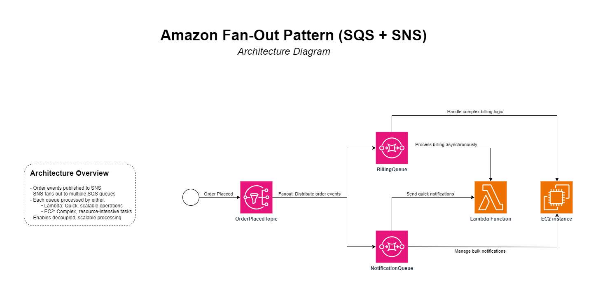
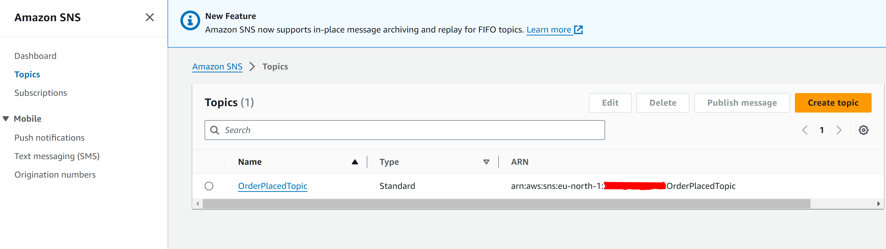
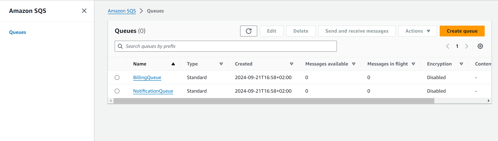
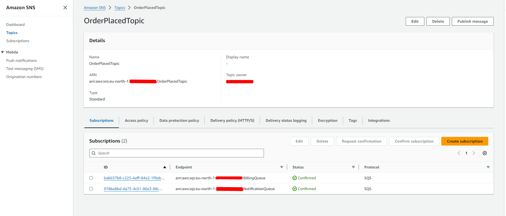
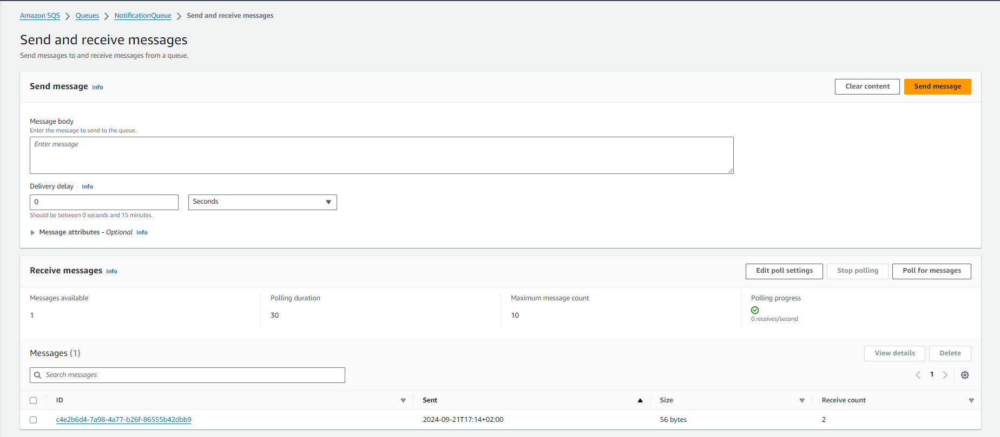
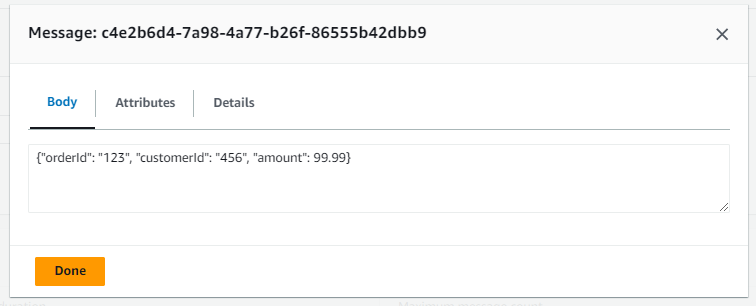
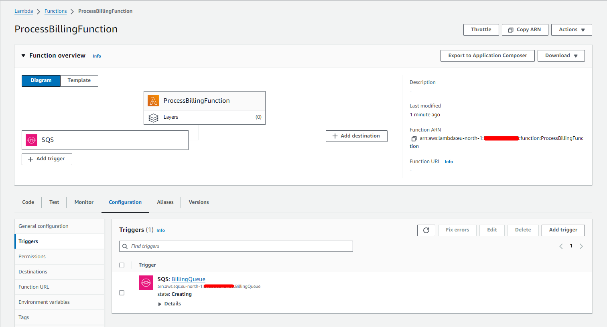
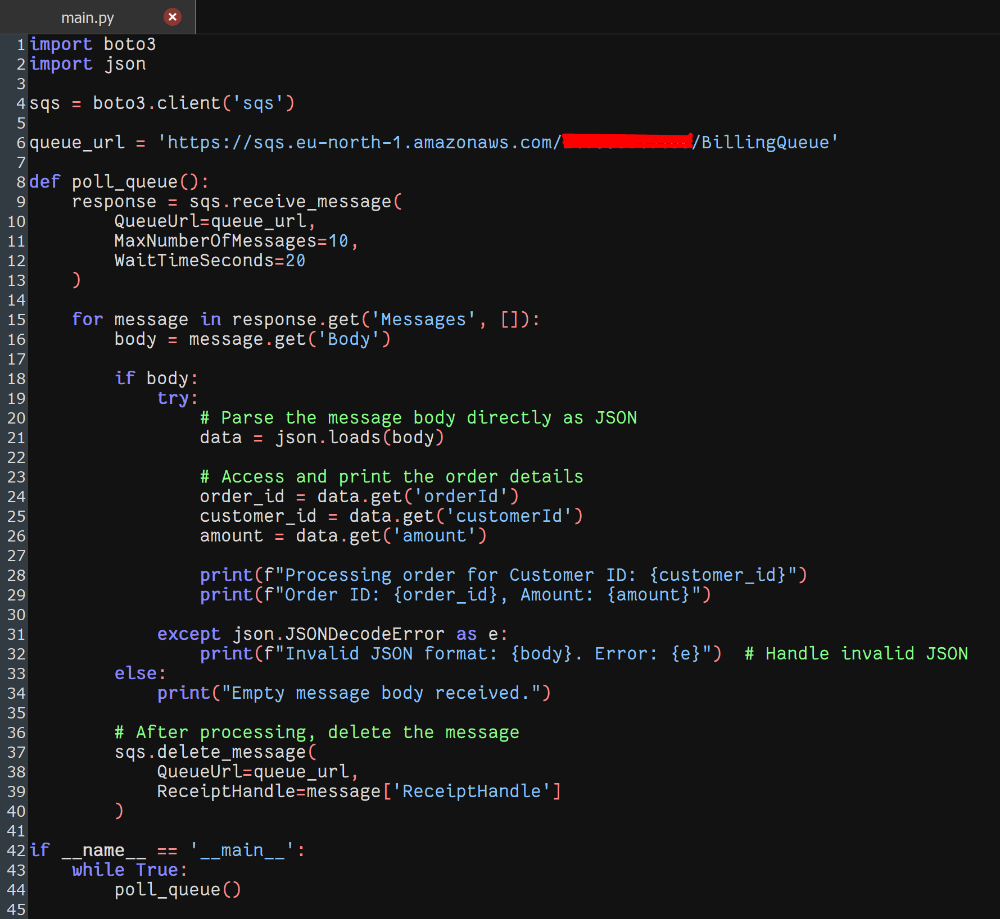
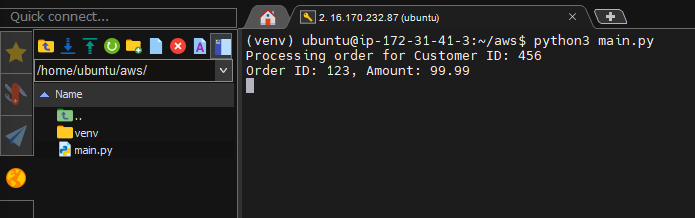

# Amazon Fan-out Pattern (SNS + SQS)

**Author**: Aleksandër Pulla  
**Date**: 09/21/2024

## Use Case: Order Processing System

You are managing an e-commerce platform, and when an order is placed, multiple services need to be notified to process the order:

1. **Order Service**: The core service responsible for creating and managing orders.
2. **Billing Service**: Processes payments.
3. **Notification Service**: Sends an email or SMS to the customer confirming the order.

To handle this efficiently, you want to decouple the services using a **fan-out pattern**. Amazon SNS will act as the event broadcaster (publisher), and the services will be consumers using Amazon SQS queues.

### Integration of Lambda Functions and EC2 Instances:

To process the messages from the SQS queues and perform the actual business logic, you can use either AWS Lambda functions or EC2 instances:

- **AWS Lambda Functions**: These serverless functions can be triggered automatically when new messages arrive in the SQS queues. Each function (e.g., for billing or notification) will process its respective queue's messages, executing the required business logic without the need to manage any infrastructure.

- **EC2 Instances**: For more complex or resource-intensive processing, you can use EC2 instances. These virtual servers can run applications that continuously poll the SQS queues for new messages, process them, and perform the necessary actions for each service.

By utilizing Lambda functions or EC2 instances, you create a fully automated system where:

1. An order is placed, triggering a message to be published to the SNS topic.
2. The SNS topic fans out this message to multiple SQS queues.
3. Lambda functions or applications on EC2 instances consume these messages from their respective queues.
4. Each service (Billing, Notification, etc.) processes the order information independently and concurrently.

This approach ensures scalability, fault-tolerance, and decoupling of services in your e-commerce platform's order processing system.



---

## Step 1: Set Up an Amazon SNS Topic

1. Log in to the AWS Management Console.
2. Navigate to **Amazon SNS**.
3. Click on **Create topic**.
   - **Type**: Select `Standard`.
   - **Name**: Name the topic `OrderPlacedTopic`.
4. Click **Create topic**.



---

## Step 2: Create SQS Queues for Each Service

1. Go to **Amazon SQS** in the AWS Management Console.
2. Click on **Create queue** for each service:

   - **Queue 1**:
     - **Name**: `BillingQueue`
     - **Type**: Standard queue.
   - **Queue 2**:
     - **Name**: `NotificationQueue`
     - **Type**: Standard queue.

   Repeat this process for as many services as you need.



---

## Step 3: Subscribe the SQS Queues to the SNS Topic

1. Go back to **Amazon SNS**.
2. Click on the **OrderPlacedTopic** you created earlier.
3. Click on **Create subscription**.
   - **Protocol**: Choose `SQS`.
   - **Endpoint**: Select the ARN of `BillingQueue`.
4. Click **Create subscription**.
5. Repeat the above steps to add another subscription for `NotificationQueue`.



---

## Step 4: Publish a Test Message to the SNS Topic

1. In **Amazon SNS**, select your **OrderPlacedTopic**.
2. Click on **Publish message**.
3. Enter a sample message:
   - **Subject**: `Order #123 placed!`
   - **Message body**: `{"orderId": "123", "customerId": "456", "amount": 99.99}`
4. Click **Publish message**.

---

## Step 5: Verify Messages in SQS Queues

1. Go to **Amazon SQS**.
2. Select `BillingQueue` and check for the new message.
3. Similarly, check the `NotificationQueue`.

Each queue should have received the message published by the SNS topic, demonstrating the fan-out pattern.





---

## Step 6: Simulate Real Services with Lambda Functions or EC2 Instances

You can configure **Lambda functions** or **EC2 instances** to consume messages from the SQS queues and perform business logic.

### Option 1: Using AWS Lambda

1. Navigate to the **AWS Lambda** service in the AWS Management Console.
2. Click on **Create function**.
   - Choose **Author from scratch**.
   - **Function name**: `ProcessBillingFunction`.
   - **Runtime**: Choose a runtime (e.g., Node.js, Python).
3. In the **Execution role**, select an existing role or create a new one with the required permissions to access SQS.
4. After the function is created, go to the **Function overview** section.
5. Under **Add Trigger**, select **SQS** as the trigger.
   - Choose the **BillingQueue**.
6. In the **Function code** section, add code to process the messages, for example:

   ```python
   import json

   def lambda_handler(event, context):
       for record in event['Records']:
           body = json.loads(record['body'])
           print(f"Processing billing for Order ID: {body['orderId']}, Amount: {body['amount']}")
   ```

7. Click **Deploy** to save the function.
8. The function will now be triggered whenever there is a new message in `BillingQueue`.



### Option 2: Using EC2 Instances

1.  Launch an **EC2 instance** in your desired region.
2.  SSH into the instance and install the AWS CLI:

    ```bash
    sudo apt update
    sudo apt install awscli -y
    ```

3.  Configure the instance with the required IAM role to access SQS.
4.  Write a script that polls the SQS queue for messages, for example, in Python:

```python
import boto3
import json

sqs = boto3.client('sqs')

queue_url = 'https://sqs.<region>.amazonaws.com/<accountID>/BillingQueue'

def poll_queue():
    response = sqs.receive_message(
        QueueUrl=queue_url,
        MaxNumberOfMessages=10,
        WaitTimeSeconds=20
    )

    for message in response.get('Messages', []):
        body = message.get('Body')

        if body:
            try:
                # Parse the message body directly as JSON
                data = json.loads(body)

                # Access and print the order details
                order_id = data.get('orderId')
                customer_id = data.get('customerId')
                amount = data.get('amount')

                print(f"Processing order for Customer ID: {customer_id}")
                print(f"Order ID: {order_id}, Amount: {amount}")

            except json.JSONDecodeError as e:
                print(f"Invalid JSON format: {body}. Error: {e}")  # Handle invalid JSON
        else:
            print("Empty message body received.")

        # After processing, delete the message
        sqs.delete_message(
            QueueUrl=queue_url,
            ReceiptHandle=message['ReceiptHandle']
        )

if __name__ == '__main__':
    while True:
        poll_queue()
```

5.  Set the script to run continuously on the EC2 instance.





---

## Additional Notes:

- **BillingQueue** will trigger a billing process when an order is placed.
- **NotificationQueue** will send a confirmation notification to the customer.

You can simulate real services by configuring Lambda functions or EC2 instances to consume messages from the SQS queues. By following this pattern, you decouple services and ensure that each one processes the event independently, improving scalability and maintainability.
