# **Real-Time Chat Application on AWS Serverless Architecture**

## **Overview**

This project is a **real-time chat application** built using **React (front-end)** and **Node.js (back-end)**. The application is designed to handle real-time messaging with **SocketIO** for WebSocket communication and session management with **Redis**. In the back-end, **DynamoDB** is used for storing user information and chat messages. In production, we plan to leverage **AWS Lambda**, **API Gateway**, and **ElastiCache (Redis)** for scaling the back-end services.
 

## Solution Architecture 

<!-- Remove the above title once the diagram is ready -->

<!-- TODO: Architecture Diagram -->

 

## **Front-End (React with Vite)**
The front-end uses **React** for building a responsive user interface, with **React Router** for routing between components like `Login`, `Register`, and `ChatRoom`. **Vite** is used as the build tool to streamline development and improve performance.

**Front-End Directory Structure (Client):**
- **src** folder includes:
  - **components** folder containing `Login.jsx`, `Register.jsx`, `ChatRoom.jsx`, and `ProtectedRoute.jsx`.
  - **App.jsx** manages routing, middleware for route protection, and the general structure of the application.
  
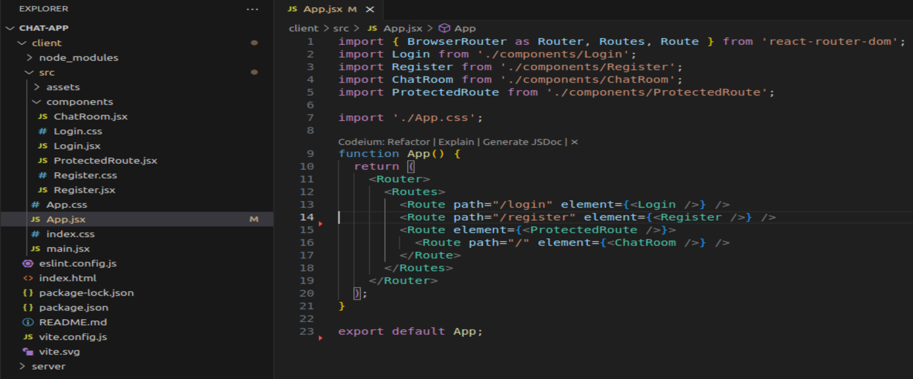

## **Back-End (Node.js with Express)**

The backend of this project is built using **Node.js** with **Express.js** to manage HTTP routes and handle API requests. For real-time messaging, **SocketIO** is integrated to provide WebSocket communication between users. 

During development, **Redis** is used locally for session management, which will be later replaced by **AWS ElastiCache (Redis)**. **DynamoDB** stores user credentials and chat messages. 

The backend structure is modular, with separate configuration files for different services and middleware.

**Back-end Directory Structure (Server):**
- **server** folder includes:
  - **config** folder, which contains the following files for configuring DynamoDB and Redis:
    - `dynamoDBClient.js` file, which provides a higher-level abstraction for handling JSON data, making it easier to interact with DynamoDB.
    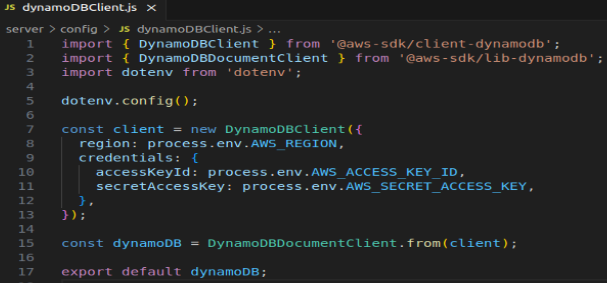
    - `redisClient.js` file configures the **Redis client** using the *redis* and *connect-redis* libraries. The code sets up a Redis client connection with host and port information sourced from environment variables. This configuration also includes a Redis store to manage session data.
    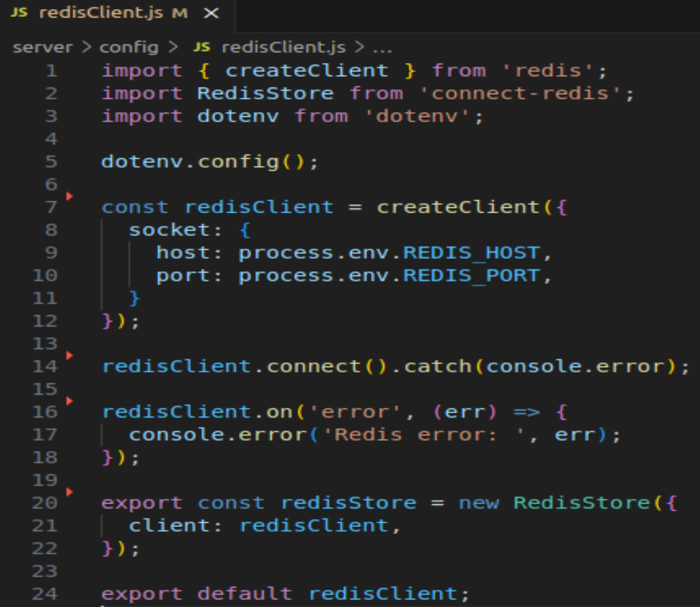
  - **middleware** folder, containing `authMiddleware.js` file, which is responsible for protecting routes by ensuring that a user is authenticated. It checks for a valid session and verifies that a username exists in the session. If the session is valid, the request proceeds to the next middleware or route handler. If not, it responds with a `401 Unauthorized` status code and a JSON object indicating an error, along with a redirect path to the `/login` page.
  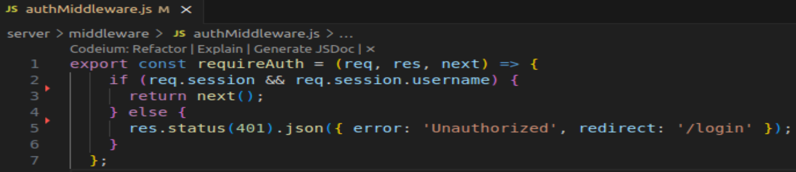
  - **routes** folder, containing `auth.js` file, which is responsible for defining the Express routes for user authentication (register/login/logout functionalities).
  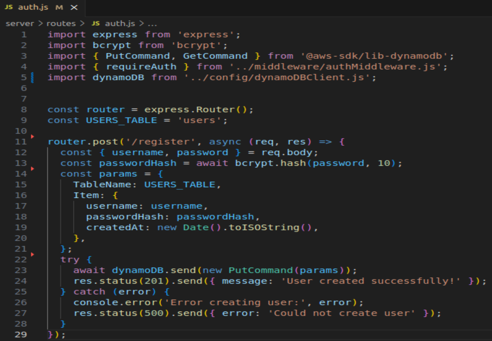
  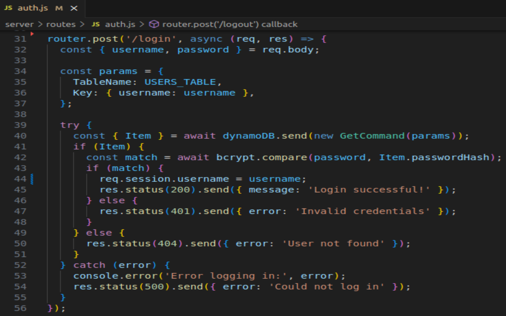
  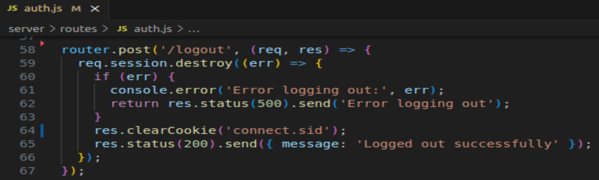
  It utilizes `DynamoDB` for user data storage and `bcrypt` for password hashing and verification. Additionally, it imports the `requireAuth` middleware for protecting certain routes.
  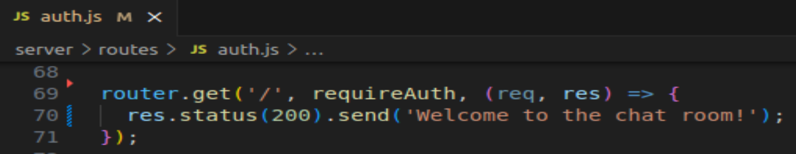
  - **sockets** folder, containing `socket.js` file, which is responsible for the real-time communication within the chat application using `Socket.IO`. It manages WebSocket connections, handles events related to user actions, and interacts with DynamoDB to store and retrieve chat messages.
  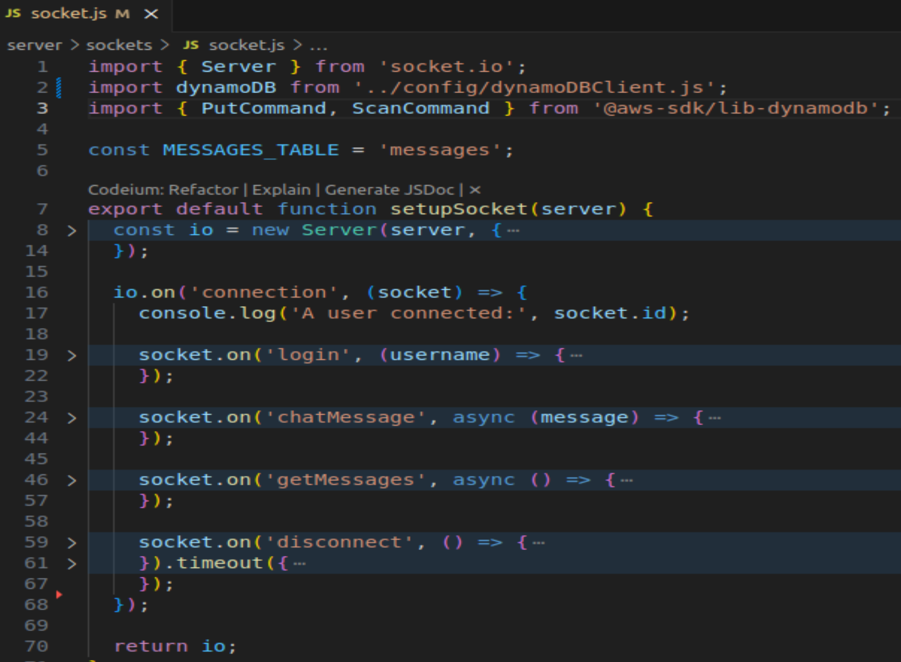
  - **server.js** file, which is the entry point for the Node.js back-end application. It accomplishes the following operations:
    - sets up the Express server;
      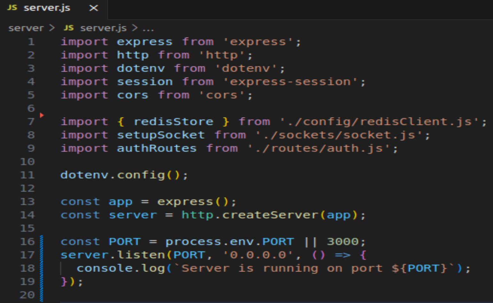
    - configures middleware for session management and CORS;
      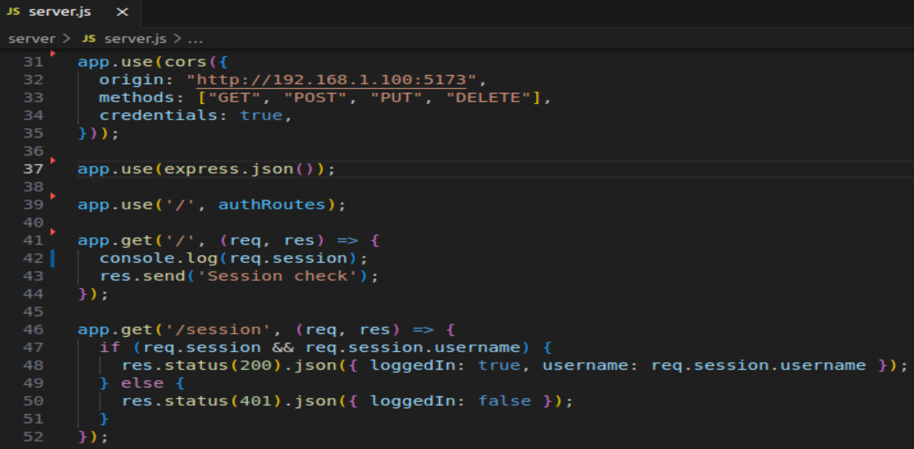
    - initializes SocketIO for real-time communication;
      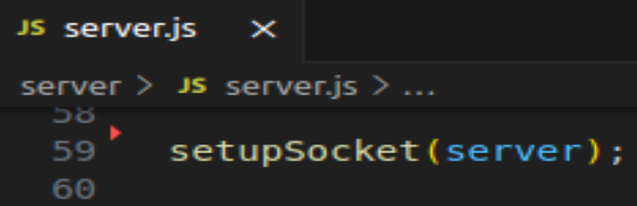
    - sets up Redis for session storage;
      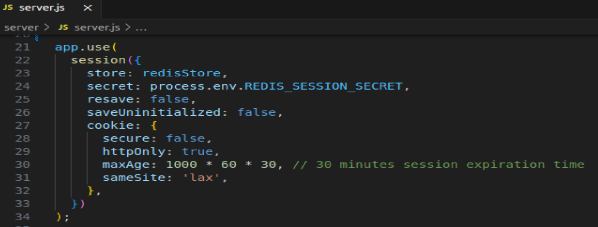
    - handles authentication routes.
      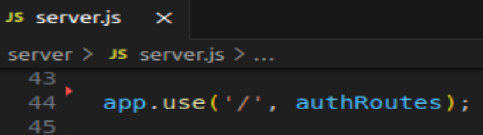

  - **.env** file, which is responsible for storing environment variables that are essential for configuring the backend application securely and efficiently. 
  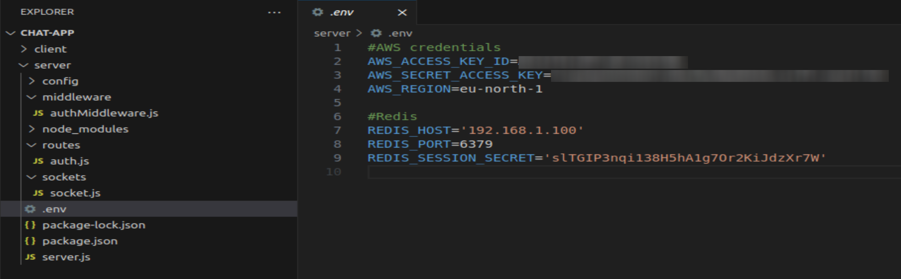

 

## Demo

This section consists of several scenarios, demonstrating the user experience of the application while implementing all the project's requirements.

**Scenario #1: User Login & Session Persistence in Redis**

In this scenario, a user logs into the chat application using their credentials. Upon successful authentication, a session is created and stored in Redis. This session includes user details and an expiration time to manage user activity. The application checks Redis for the session on each request to maintain the logged-in state. If the session is found, the user remains logged in, ensuring a seamless experience.

**Scenario #2: Real-Time Data Streaming & Ingestion from Amazon DynamoDB**

In this scenario, data is firstly added in an Amazon DynamoDB table, triggering a real-time ingestion pipeline. The processed data is then ingested back to the chat via SocketIO in real-time, thus enabling a smooth conversation between the users.

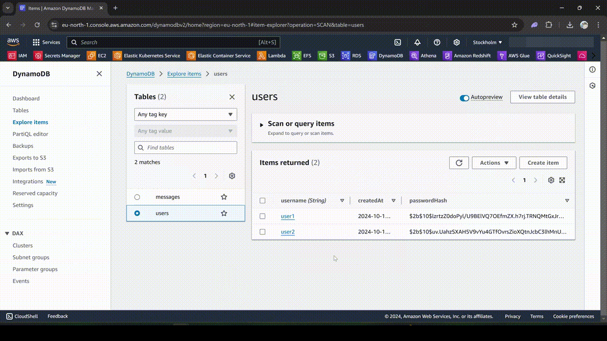

**Scenario #3: User Logout expires session in Redis**

In this scenario, when a user initiates a logout, the application explicitly removes the user's session from Redis. This ensures that any further requests by the user will require re-authentication. 

**Scenario #4: Session expiration in Redis logs out the user**

In this scenario, a session stored in Redis naturally expires after its set time-to-live (TTL) period. When the user makes a request after the session has expired, the application detects the absence of the session in Redis and treats the user as logged out. This results in the user redirection to the login page, ensuring user authentication remains up to date.

NOTE: As my session's TTL is set to 30 minutes, for the demo purposes I have simulated the session expiration process by flushing out the database of Redis.

 

## "Flying to the cloud with serverless wings"

In this phase, we migrate core backend functionality from local development to a **serverless AWS architecture**. This transition enables our application to scale effortlessly while optimizing for cost and performance. 
> **Note**: This hybrid setup keeps front-end and real-time messaging with SocketIO local, while offloading authentication, session management, and data storage to the cloud.

---

#### **Key AWS Services for Migration**

1. **AWS Lambda**: 
   - Handles backend logic for routes such as **user authentication** and **session management**.
   - Replaces the local Express server, removing the need to manage servers.
   - Automatically scales with usage, providing a cost-effective solution for variable workloads.

2. **Amazon API Gateway**:
   - Exposes the backend routes managed by AWS Lambda as HTTP endpoints.
   - Routes requests from the local frontend to the appropriate Lambda functions.
   - Enables CORS to allow cross-origin requests from the local frontend, ensuring secure communication.

3. **Amazon ElastiCache (Redis)**:
   - Replaces the local Redis instance for **session persistence**.
   - Stores session data to manage authenticated user sessions in the cloud, ensuring consistency across multiple backend requests.
   - Provides automated failover, backups, and monitoring, improving availability and resilience.

---

#### **Migration Steps**

**1. Replace local Redis with ElastiCache for Session Management**

> Note: Since Amazon ElastiCache for Redis does not support publicly accessible endpoints, you will need to think of a way how to privately connect to it. There are different approaches that can be taken into consideration (i.e. build a VPN connectivity with the private resource, establish Direct Connect for private communication, etc.), however for this hands-on project I will be using EC2 instance as Bastion Host.

To manage sessions in the cloud:

- Create an ElastiCache Redis cluster and obtain the connection endpoint.
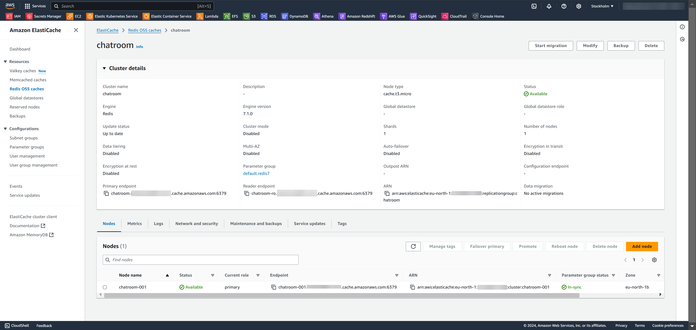
- Launch EC2 instance within the same VPC that ElastiCache is deployed and SSH into it.
- Deploy a Redis Client (I am using the dockerized version of Redis Insights - https://redis.io/docs/latest/operate/redisinsight/install/install-on-docker/)
- Configure security group of the Bastion Host to allow access to port 80 (HTTP), as well as 5540 (default port of Redis Insights)
- Access Redis Client and connect to ElastiCache
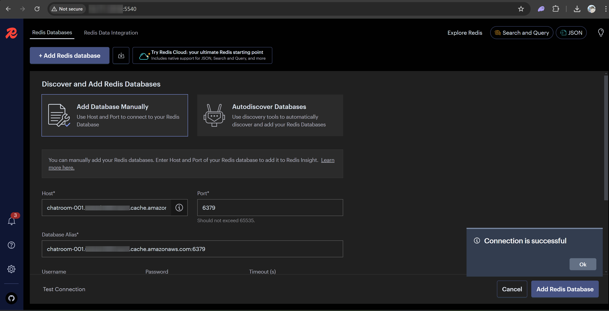
- Update Lambda functions to connect to ElastiCache Redis instead of local Redis, ensuring sessions are stored centrally.
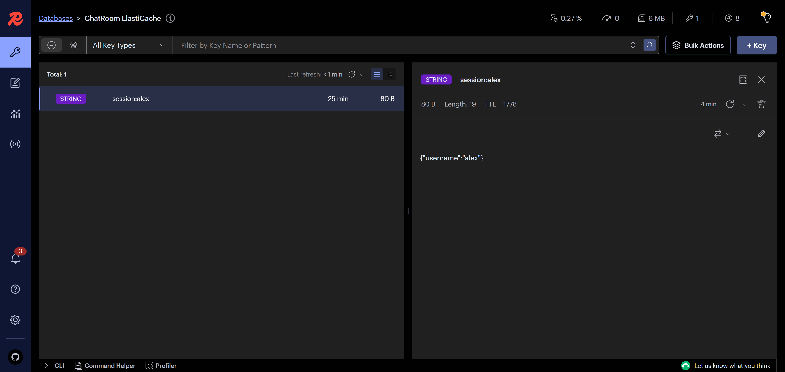

This ElastiCache setup provides consistent session management across all Lambda functions and maintains session data reliability.

**2. Convert Backend Routes to Lambda Functions**

Each backend route previously managed by Express is now restructured into AWS Lambda functions. These functions include:
- **Register**: Hashes and stores user data in DynamoDB.
- **Login**: Validates user credentials, initiates a session, and stores session data in ElastiCache.
- **Logout**: Clears session data from ElastiCache.
- **ProtectedRoute**: The protected route checks for a valid session in ElastiCache before returning a response.

In order to migrate the entire back-end Express logic in a serverless manner to the cloud, the following tasks must be accomplished:
- Express source code to be converted to AWS Lambda logic (asynchronous handler function that accepts an event as parameter)
  - **`register.mjs`**
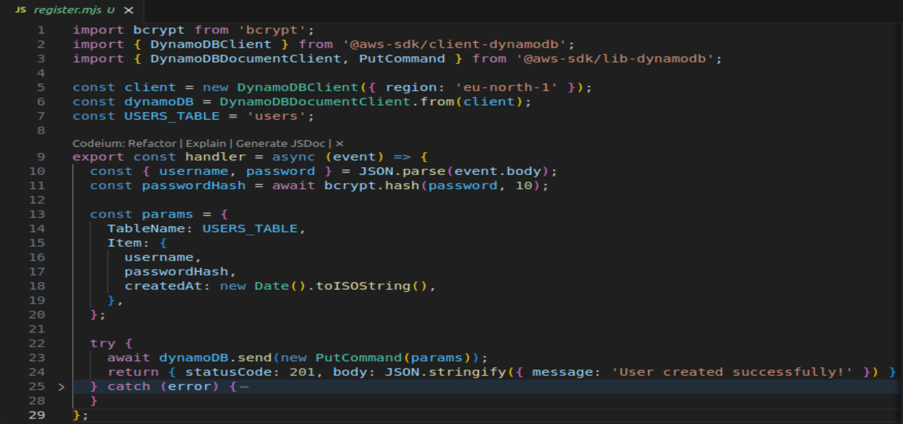
  - **`login.mjs`**
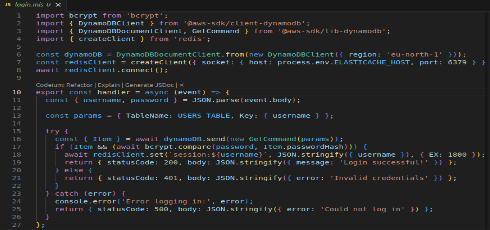
  - **`logout.mjs`**
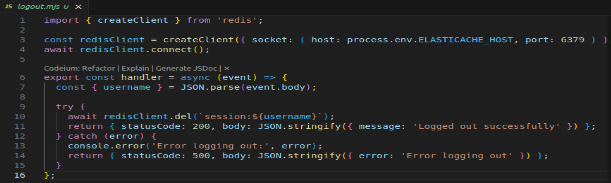
  - **`protected.mjs`**
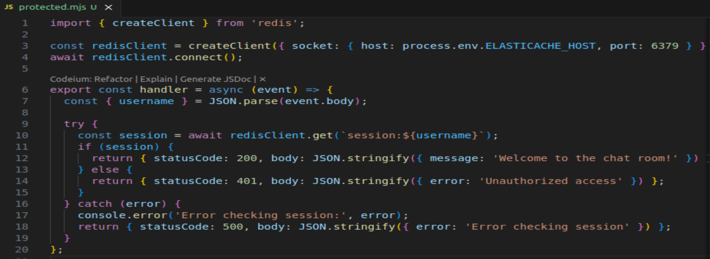
- Lambda function handlers to be zipped with 'node_modules' file, since we are using external packages (i.e. 'bcrypt', 'redis', etc.) there's no way to install the dependencies as we have been doing locally due to the serverless nature of AWS Lambda:
  - For the **Register** functionality we will be shipping only its respective handler code, as well as 'node-modules' (since we are using 'bcrypt' to hash user's password)
  - For the **Login** functionality we will be shipping same as above, whereas for the '.env' environment variable file we will be referencing those from the 'Environment Variables' config option of Lambda (as we will be referencing ElastiCache url in a secure way, without exposing it to the public)
  - For **Logout** and **ProtectedRoute** functionalities we will be doing the same procedure as above
  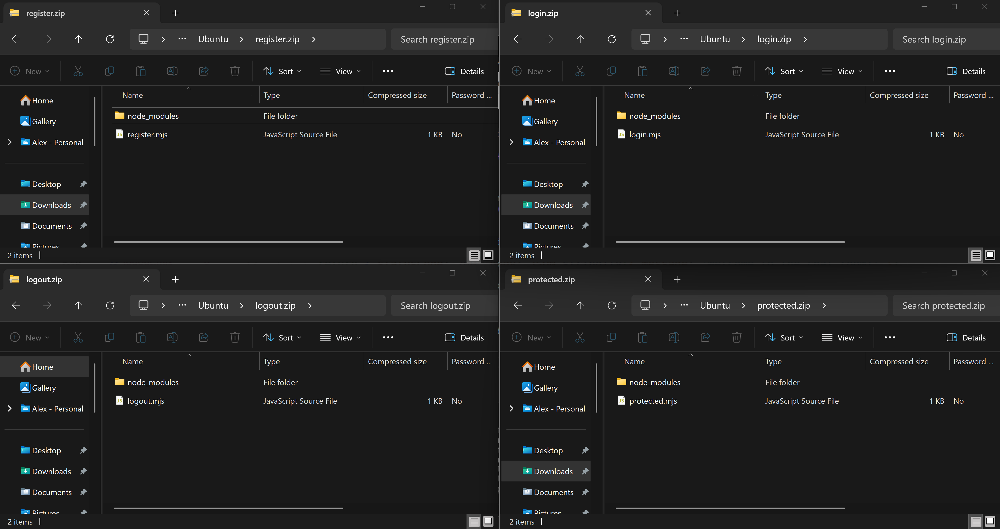
- Create IAM Role with least privilege principle for each Lambda function 
  - For the **Register** lambda function, we will be attaching only `dynamodb:PutItem` action (as this function is responsible only for creating the user and adding its credentials to the 'users' table in DynamoDB)
  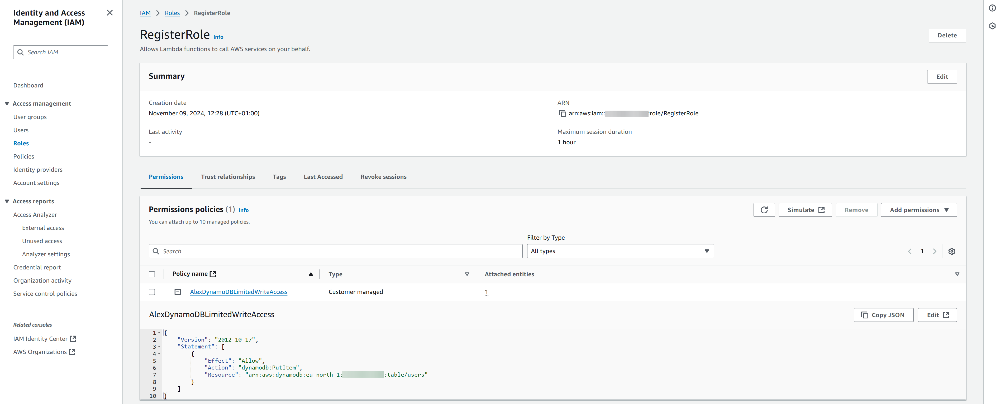
  - For the **Login** lambda function, we will be attaching only read-only access to DynamoDB via `dynamodb:GetItem` action, as well as write-only access to ElastiCache, in order to read user's credentials and write the session to ElastiCache
  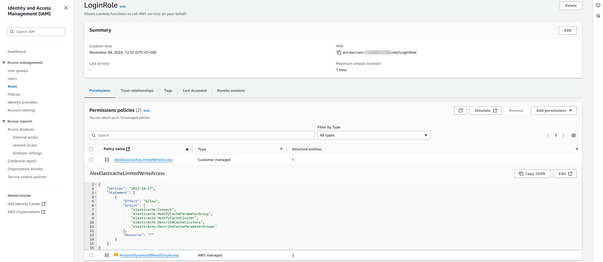
  - For the **Logout** lambda function, we will be attaching basic access with the option to delete the session's data
  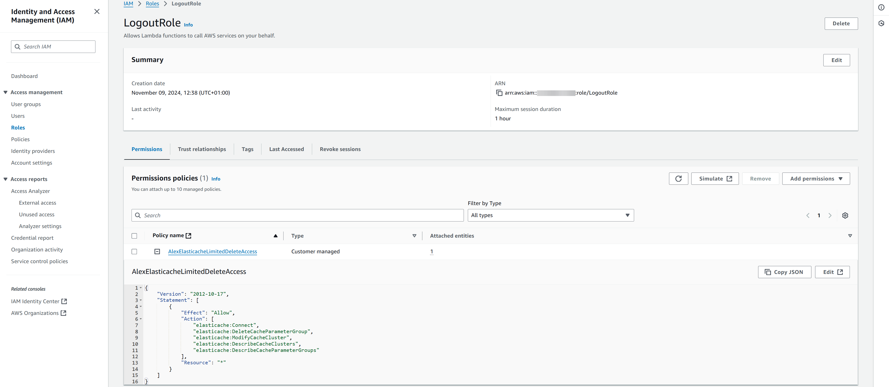
  - For the **ProtectedRoute** lambda function only basic access is required (only for checking if a session exists)
  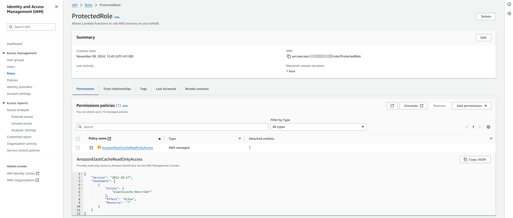
- Create Lambda function for each feature
  - Select `Author from scratch` for the template option
  - Define a name for each function
  - For the 'Runtime' select `Node.js 20.x` (the latest LTS version supported)
  - On the 'Change default execution role' section, select `Use an existing role` and choose the IAM role that you created earlier for the respective function
  - After reviewing all the above steps, click 'Create Function'
- Upload Deployment Package to Lambda for each function
  - In your Lambda function's Code tab, select Upload from > .zip file.
  - Select the zipped function you packaged earlier and upload it
  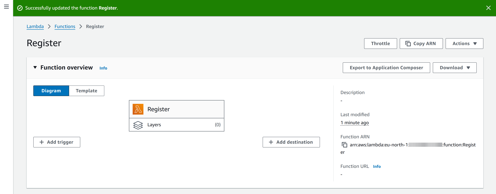
- Additional configurations
  - Update the `Handler` configuration under 'Runtime Settings' (i.e. if the handler function is called `register.mjs` and the exported function name is called `handler` as default, the configuration field for the handler should be `register.handler`)
  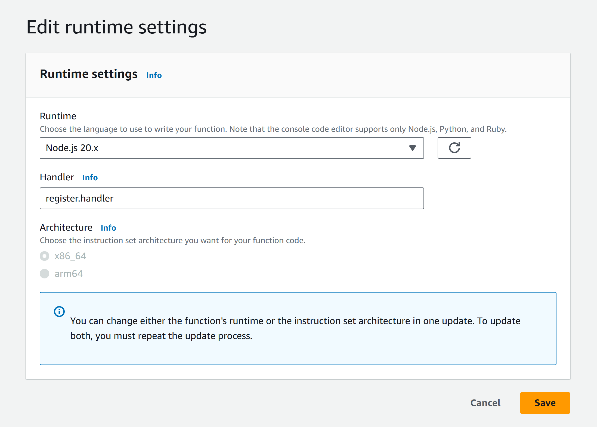
  - Set Environment Variables (Optional)
    - We will be using this only for referencing the url of ElastiCache
- Deploy & Test the Lambda function
  - Create a test event in the `Test` tab
  - Define a name and configure the body of JSON event:
    - `{"body": "{\"username\": \"<username>\", \"password\": \"<password>\"}"}`
  - Save and run the test
  
- Review the results
  - Once the test finishes, check the status code and the JSON response from the server
  **`Register function`**
  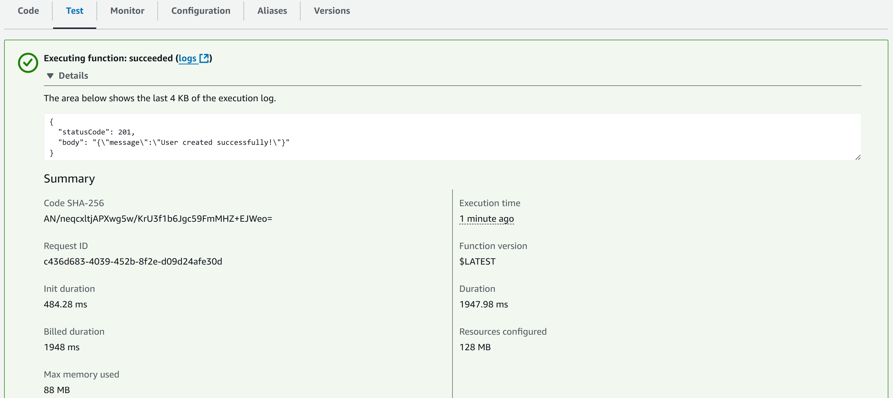
  **`Login function`**
  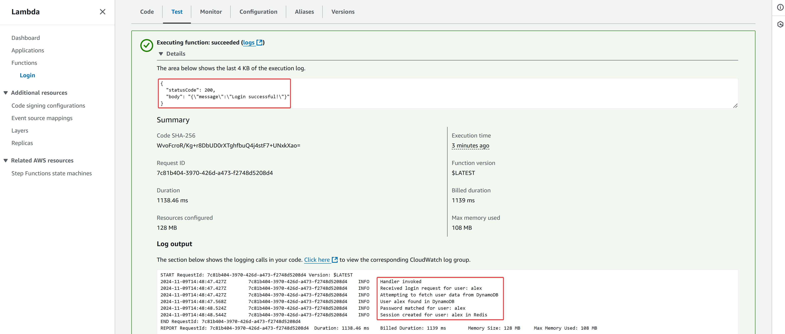
  **`Logout function`**
  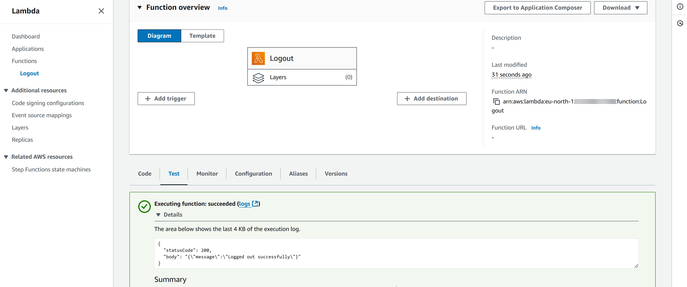
  **`Protected function - Session Persistent`**
  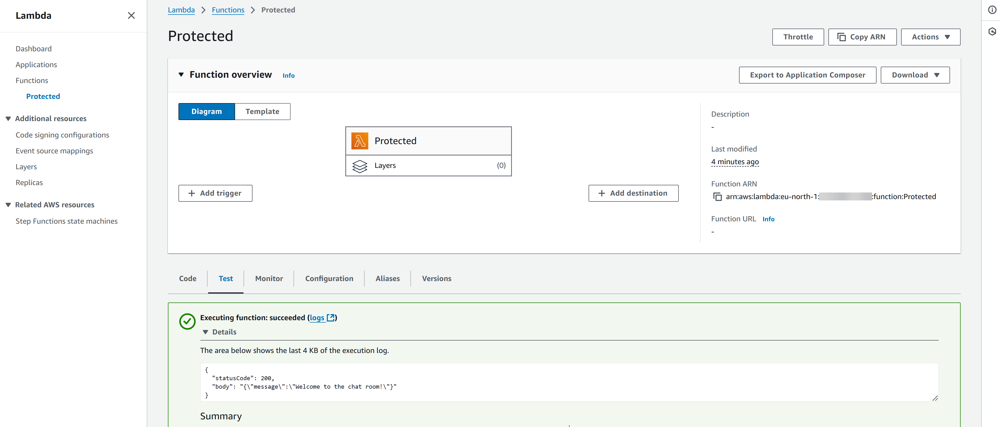
  **`Protected function - Session Expired`**
  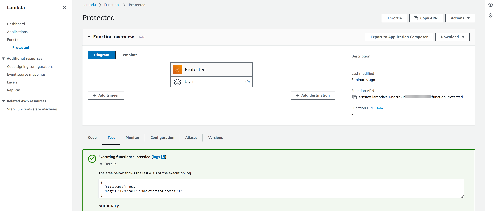
  - Verify the result on the respective AWS service:
    - For the **Register** functionality the user's credentials should be added to the `users` table within DynamoDB
    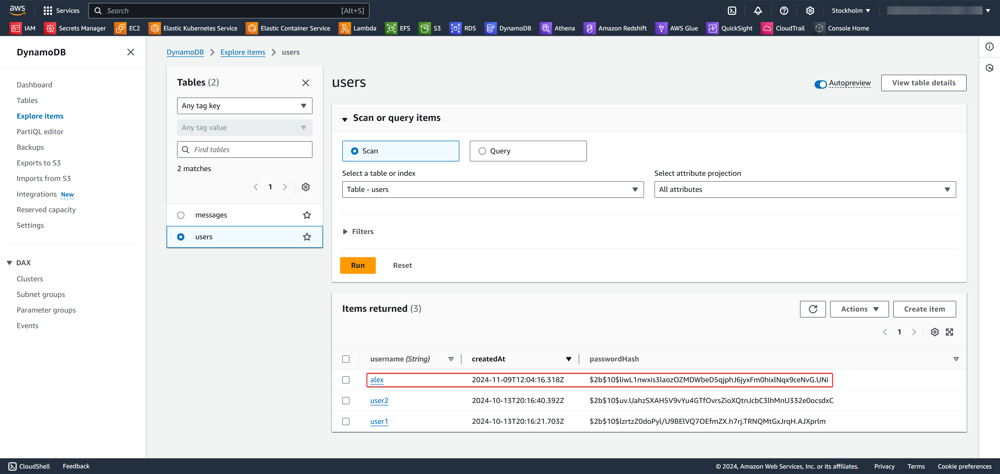
    - For the rest of the functionalities check session data on ElastiCache 
      

**3. Set Up API Gateway as the Entry Point**

Create a REST API in API Gateway to route requests to the Lambda functions. Configure each route and method:

- **/login**: Connects to the login Lambda for user authentication.
- **/register**: Connects to the register Lambda for new user registration.
- **/logout**: Connects to the logout Lambda to end user sessions.

CORS Configuration:

- Enable CORS to allow requests from the local frontend (e.g., http://localhost:5173).
- API Gateway will handle cross-origin requests and securely pass them to Lambda functions.

<!-- TODO: Finish migration with API Gateway -->

**4. Configure Frontend to Use API Gateway Endpoints**

Update the local frontend to interact with API Gateway instead of the local backend. For each route (e.g., login, register), replace the local URL with the API Gateway endpoint.

<!-- TODO: Configure Frontend to Use API Gateway Endpoints -->