# Real-Time IoT Data Streaming & Analytics Pipeline

**Author**: Aleksandër Pulla  
**Date**: 09/28/2024

## Project Overview

This project demonstrates how to build a scalable real-time **IoT data pipeline** using AWS services like **Amazon Kinesis Data Streams**, **Data Firehose**, **Amazon S3**, and **Athena**. The pipeline streams IoT sensor data in real-time to Kinesis, ingests the data into S3 using Firehose, queries the data using Athena, and finally stores the processed results back into S3.

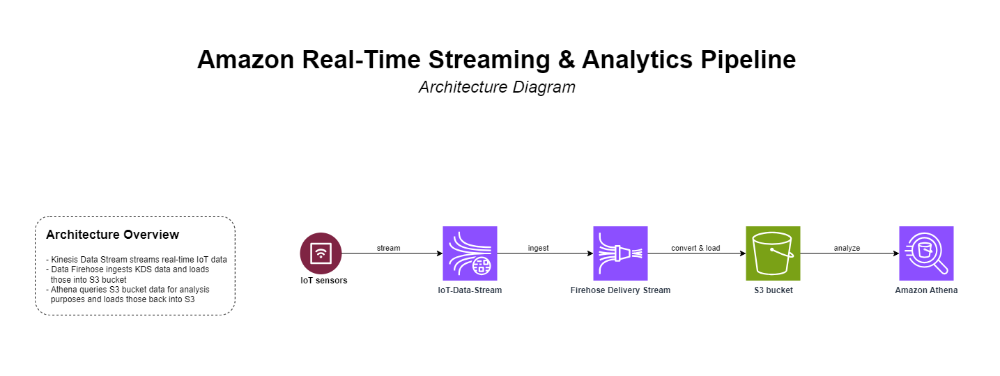

---

## 1. **Stream IoT data to Kinesis Data Stream**

### Step 1.1: Create a Kinesis Data Stream

1. Open the **AWS Management Console**.
2. Navigate to **Kinesis** and select **Data Streams**.
3. Create a new stream:
   - Name: `IoT-Data-Stream`
   - Number of shards: `1` (adjust according to traffic)
4. Click **Create Data Stream**.

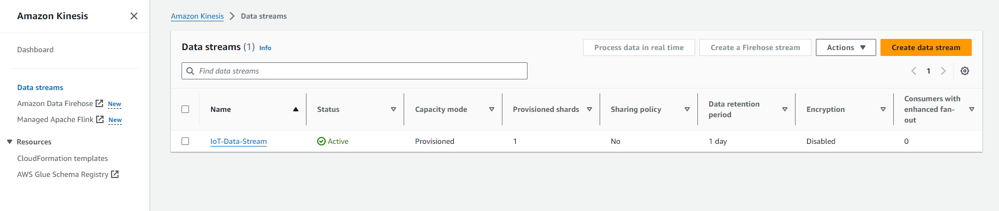

### Step 1.2: Send IoT data to Kinesis Data Stream using Python

The following Python script generates random IoT data and sends it to the Kinesis Data Stream created earlier.

```python
import random
import boto3
import json
from datetime import datetime, timedelta

# Kinesis client setup
kinesis = boto3.client('kinesis', region_name='your-region')

# IoT-related random data generation
num_records = 500

# Define the IoT sensor data fields
device_ids = ['sensor-001', 'sensor-002', 'sensor-003', 'sensor-004', 'sensor-005']
locations = ['Factory A', 'Factory B', 'Warehouse 1', 'Warehouse 2', 'Distribution Center']
statuses = ['active', 'inactive', 'faulty']

# Start time for IoT data
start_time = datetime.now() - timedelta(hours=5)

# Generate and stream IoT data to Kinesis
for i in range(num_records):
    # Randomize fields
    device_id = random.choice(device_ids)
    location = random.choice(locations)
    timestamp = start_time + timedelta(minutes=i * random.randint(1, 3))
    temperature = round(random.uniform(15.0, 30.0), 2)
    humidity = round(random.uniform(30.0, 80.0), 2)
    status = random.choice(statuses)

    # IoT data as JSON
    data = {
        'device_id': device_id,
        'location': location,
        'timestamp': timestamp.strftime('%Y-%m-%d %H:%M:%S'),
        'temperature': temperature,
        'humidity': humidity,
        'status': status
    }

    # Send data to Kinesis stream
    kinesis.put_record(
        StreamName='IoT-Data-Stream',
        Data=json.dumps(data),
        PartitionKey=device_id  # Partition key ensures data is spread across shards
    )

print("Data successfully streamed to Kinesis.")
```

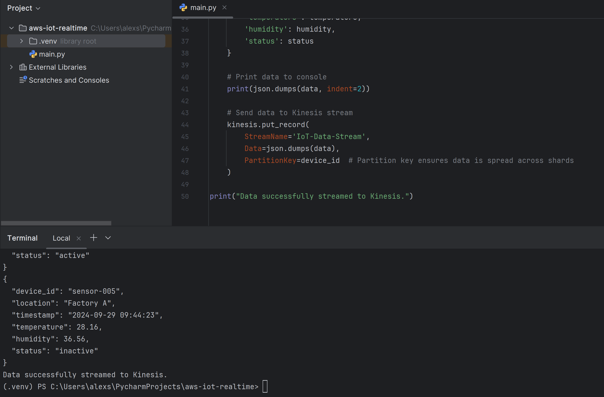

---

## 2. Ingest data from Kinesis Data Stream into S3 using Data Firehose

1. Go to the **Data Firehose Console**.
2. Click **Create Delivery Stream**.
3. Set the Source as **Kinesis Data Stream** and select the stream `IoT-Data-Stream`.
4. Set the Destination as **Amazon S3**.
5. Choose **Parquet** as the data format (this format is more efficient than JSON in terms of costs and data processing).
6. Set the buffer size and buffer interval according to the expected volume of data (e.g., 5MB or 60 seconds).
7. Choose or create an S3 bucket (e.g., `s3://iot-data/`).
8. Update the bucket prefix to load the files in a custom folder (i.e. `raw/`)
9. Click **Create Delivery Stream**.

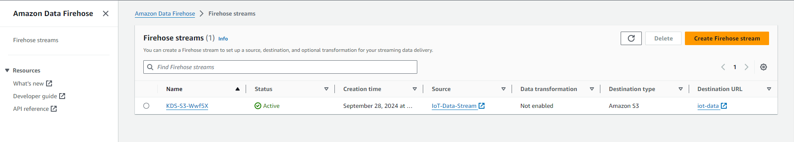

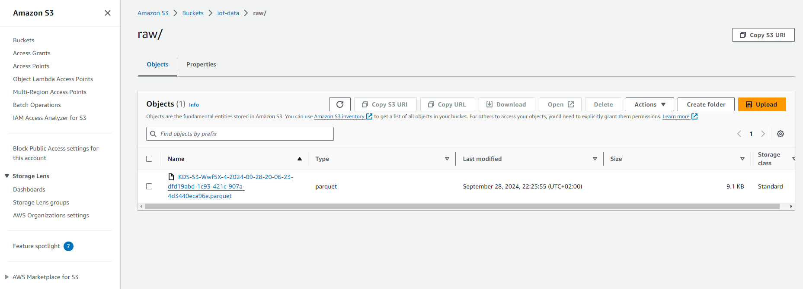

---

## 3. Query the data in S3 bucket with Amazon Athena

### Step 3.1: Create an Athena table for the IoT data

1. Open the **Athena Console**.
2. Run the following SQL query to create an Athena table pointing to the S3 bucket where the Firehose delivers the Parquet files:

```sql
CREATE EXTERNAL TABLE iot_sensor_data (
  device_id STRING,
  location STRING,
  timestamp STRING,
  temperature DOUBLE,
  humidity DOUBLE,
  status STRING
)
STORED AS PARQUET
LOCATION 's3://iot-data/raw'
TBLPROPERTIES ('parquet.compression'='SNAPPY');
```

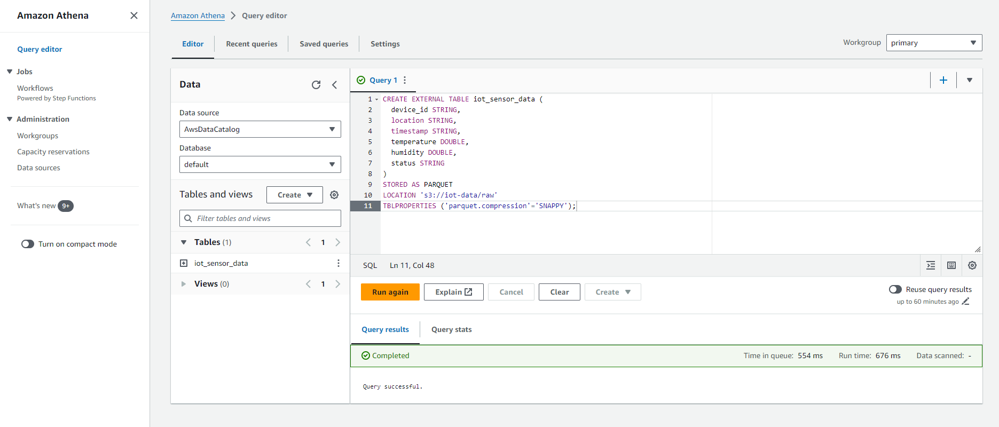

### Step 3.2: Example SQL queries to analyze the sensor data

**Query 1: Average Temperature by Location**

```sql
SELECT location, AVG(temperature) AS avg_temp
FROM iot_sensor_data
GROUP BY location;
```

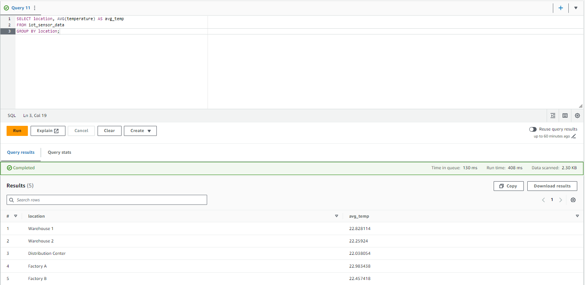

**Query 2: Count of Faulty Devices**

```sql
SELECT COUNT(*) AS faulty_device_count
FROM iot_sensor_data
WHERE status = 'faulty';
```

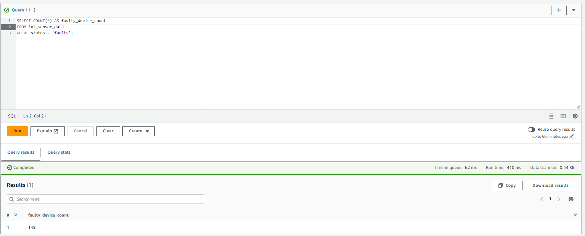

**Query 3: Find All Sensor Data with High Humidity (> 75%)**

```sql
SELECT *
FROM iot_sensor_data
WHERE humidity > 75;
```

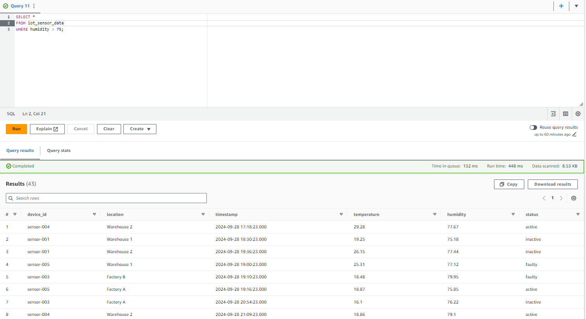

---

## 4. Store processed data back into Amazon S3

You can use Athena’s **CREATE TABLE AS SELECT (CTAS)** command to store processed data back into S3.

**Example: Store Average Temperature results back to S3**

```sql
CREATE TABLE s3_output_avg_temp
WITH (
  format = 'PARQUET',
  external_location = 's3://iot-data/processed/avg_temperature/'
) AS
SELECT location, AVG(temperature) AS avg_temp
FROM iot_sensor_data
GROUP BY location;
```

<!-- TODO: Image of the query result in Athena  -->

This query will store the results as Parquet files in the `s3://iot-data/processed/avg_temperature/` bucket.

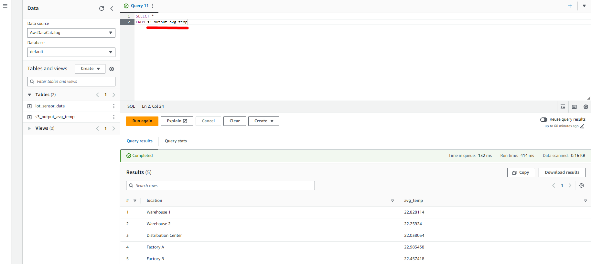

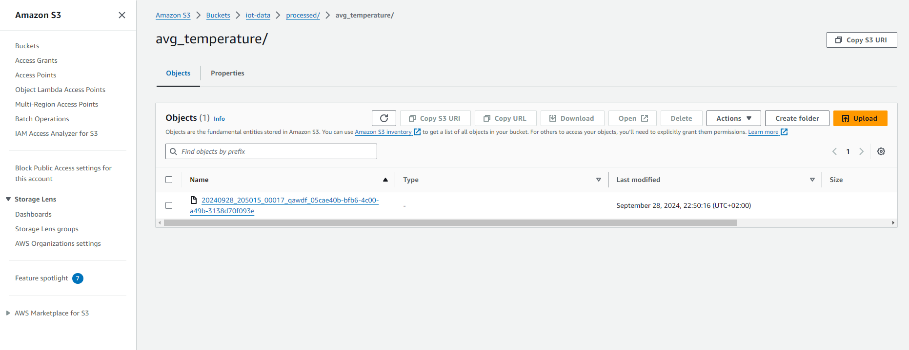

---

## Conclusion

This hands-on project showcases a complete IoT real-time data streaming & analysis pipeline using AWS:

- **Kinesis Data Stream**: Ingest real-time IoT data.
- **Data Firehose**: Load data into S3 in Parquet format.
- **Amazon Athena**: Query and analyze the data.
- **Amazon S3**: Store processed data for further analysis or downstream processing.

This setup is scalable and provides a powerful foundation for analyzing and processing IoT data in real-time.
