####Static website deployment on Amazon S3 bucket, as well as traffic routing via Route 53 and caching capabilities via CloudFront

This hands-on project explains the required resources and steps for hosting *static website* (in this scenario it corresponds to my projects portfolio) on Amazon S3 and traffic routing to the custom domain registered with Amazon Route 53.
Unfortunately, Amazon S3 website endpoints still do not support **HTTPS protocol**, however this is where Amazon CloudFront comes handy and to satisfy such requirement. Despite such fact, CloudFormation will also be used to take leverage of Edge Locations and caching capabilities, for which will improve the performance even more.

Below, I am providing the high-level architecture of the solution that satisfies the mentioned project's requirements. In summary, whenever the client will try to access www.alexpfolio.com, all the requests will be routed via Route 53 to the created distribution of AWS CloudFront, which also caches the content of static website stored in Amazon S3 bucket for performance optimization, as well as secure connection.

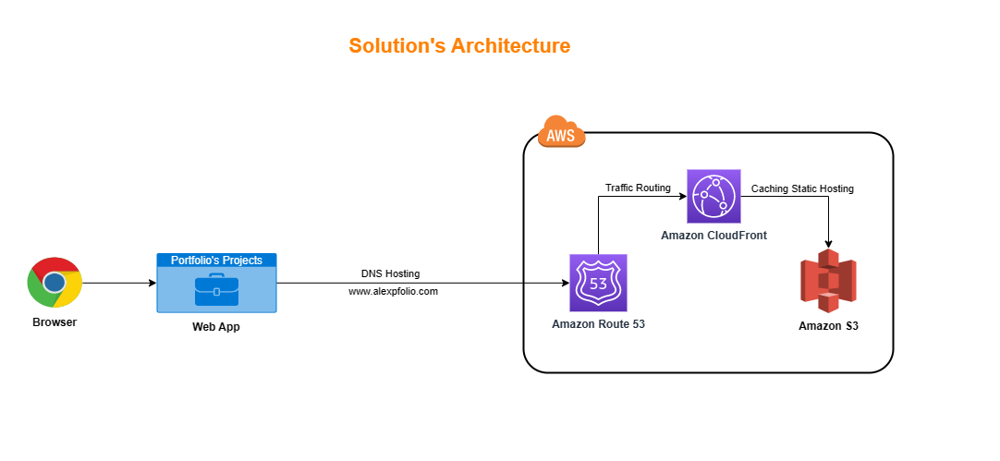

Everything starts with **domain registration** (powered by Amazon Route 53).
For the purpose of this hands-on project, I have decided to purchase and use **www.alexpfolio.com** domain. 
Here I want to mention that the *payment is processed in a single operation* (and not in a regular monthly basis).  Also, it is very important that after purchasing the domain, you need to verify it via email, otherwise it is valid only for a period of approximately 2 weeks and after that you will lose the domain, even though the payment is processed successfully.

After the domain registration process, it is time to access Amazon S3 and create two buckets
You might think by yourself *"Why do we have to create two buckets, when we can use just one to store the files of the web app?!"*
The purpose of creating two buckets is that the *primary one* (that will be called "www.alexpfolio.com") will serve as the Static Hosting, while the other one (that will be called "alexpfolio.com") will serve as the *request redirecter* (it will redirect all requests to "www.alexpfolio.com" in case the client tries to access the website without "www") and will be empty. As you can see, we are kind of implementing a "load balancer" resource within Amazon S3, which is also *cost-free* (as the bucket will be all the time empty, whereas Amazon S3 charges only for outbound data).

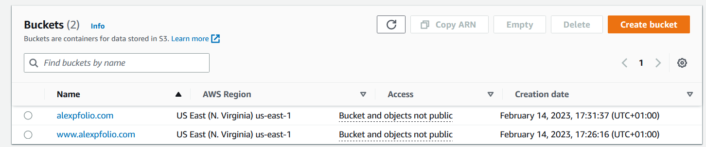

When both the buckets are successfully created (during the initial creation the default configurations were applied), let's store all the directory of the web app into the primary bucket.

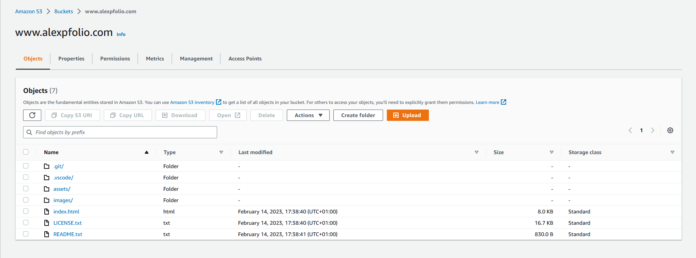

After uploading the files and folders of the web app in the primary bucket, let's go ahead and make some important configurations on that one.
First of all, the public access of the bucket should be unblocked, in order for the clients to access the website's endpoint. This can be achieved by going to the "Permissions" tab of the selected bucket and selecting "Edit Block public access". Make sure to uncheck "Block *all* public access" option and then saving the configuration.

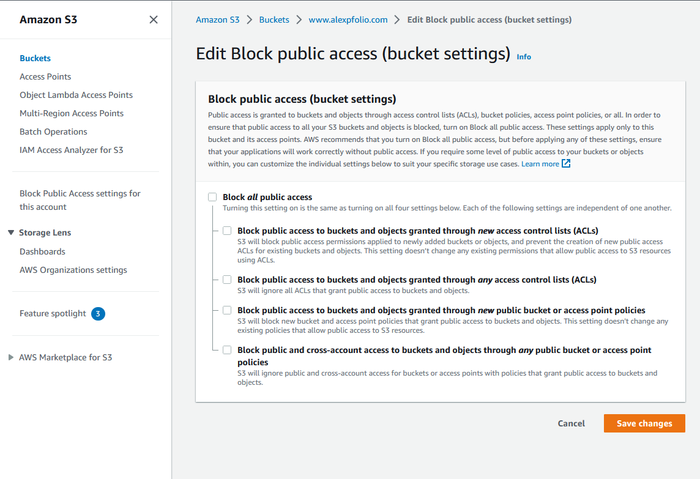

In addition, we should also update the bucket policy, in order to be able to access bucket's objects. The JSON data of the policy consists as following:

`{
    "Version": "2012-10-17",
    "Statement": [
        {
            "Sid": "PublicReadGetObject",
            "Effect": "Allow",
            "Principal": "*",
            "Action": [
                "s3:GetObject"
            ],
            "Resource": [
                "arn:aws:s3:::Bucket-Name/*"
            ]
        }
    ]
}`

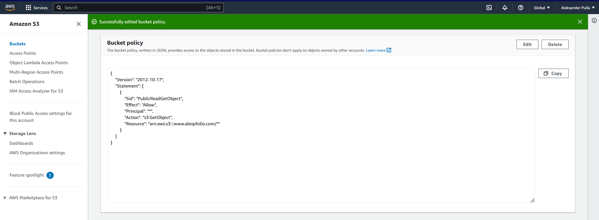

Secondly, we should also enable Static Hosting option for the primary bucket, by going to the "Properties" tab of the bucket and then selecting "Edit static website hosting". Make sure to select "Host a static website" option in the "Hosting type" feature, as well as defining "index.html" as the value of "Index document" feature. In the end of this process, save the configurations.

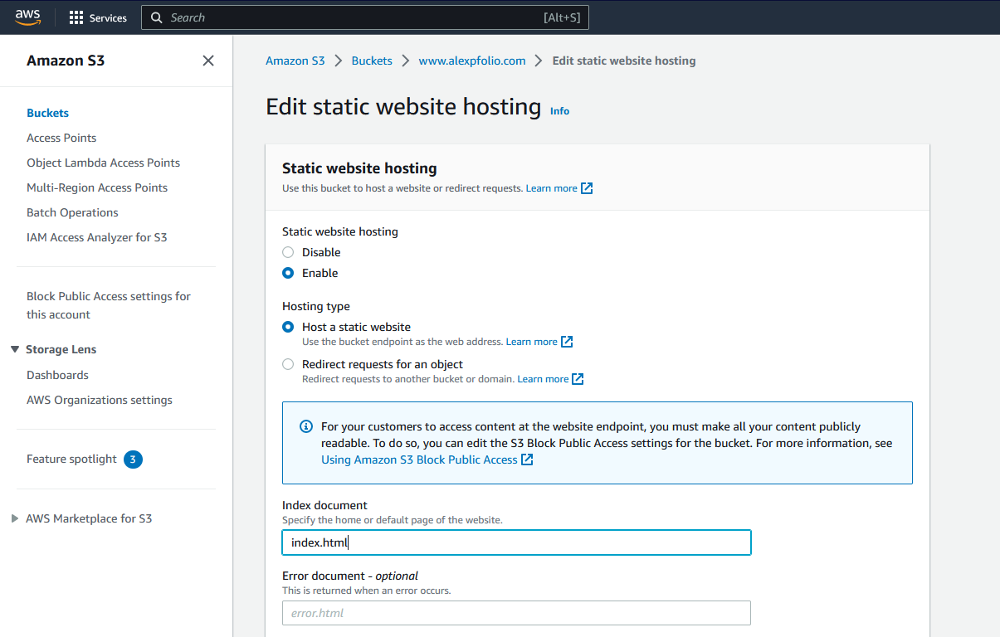

Now is time to make some configurations on the secondary bucket as well. As per this bucket, we should enable the feature of "load balancing", which can be achieved by going to the "Properties" tab of the secondary bucket and then selecting "Edit static website hosting". Make sure to select "Redirect requests for an object" option in the "Hosting type" feature, as well as defining "www.alexpfolio.com" as the value of the "Host name" option. For the "Protocol" feature let's keep the default configuration at this point (http), however we will return later to update it as well.

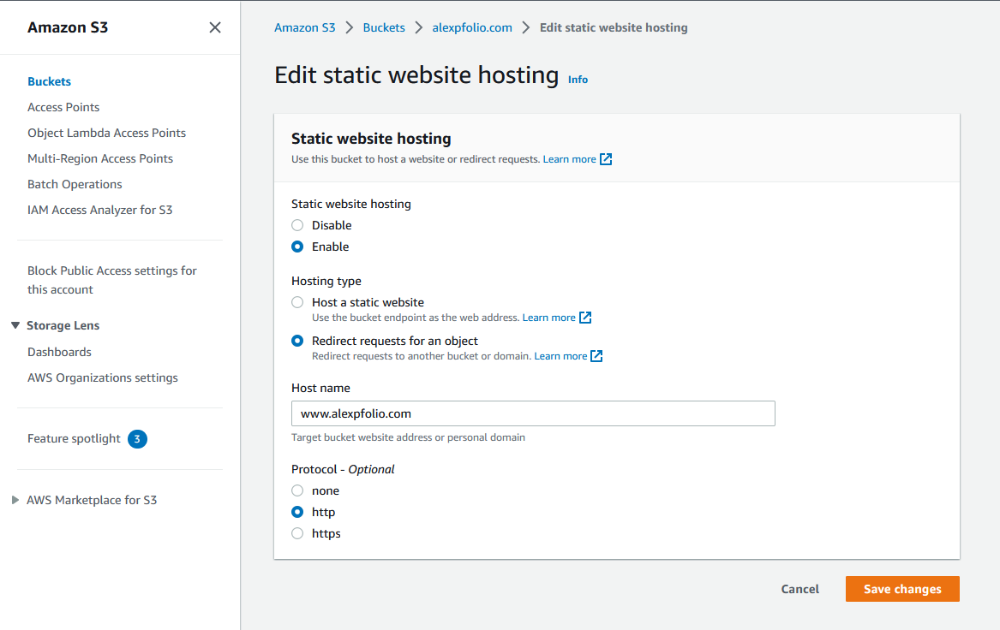

After performing all these steps, let's go back at Route 53 and proceed with the traffic routing to the newly-created S3 endpoints. For the purpose of this hands-on project, **simple routing policy** will be implemented (as it is also the most appropriate one for static web apps). Let's create simple records for both endpoints by defining the "Record name" field, as well as aliasing the S3 website endpoint as the "Route traffic" option. For the primary endpoint, define "www" value and map the respective S3 bucket endpoint for traffic routing (do the same thing for the secondary endpoint, but for that one just leave the "Record name" as blank).

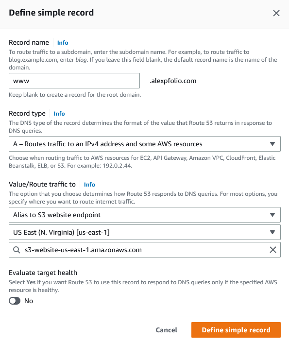

After defining the simple records for both endpoints and making sure that those are of type A, go ahead and create those by clicking "Create Records".

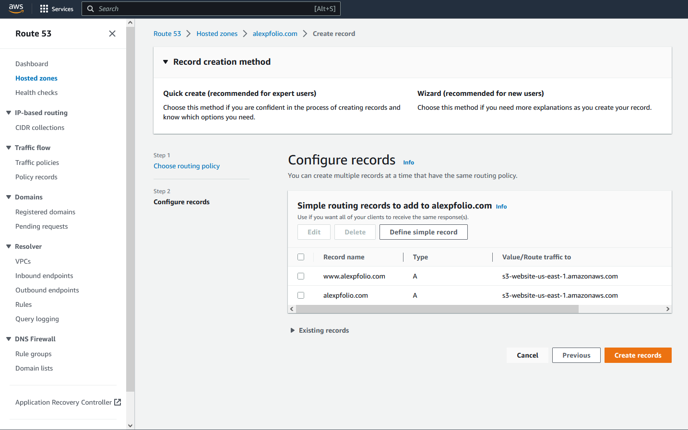

So far so good we have managed to host a static website and route the traffic in a custom domain, however our website (despite of the lack of performance optimization) is missing an essential element when it comes to deployment of modern web applications: **secure communication!**

Since Amazon S3 does not support HTTPS communication, it's time to take leverage of a very popular AWS service for global applications, called **Amazon CloudFront**. This service is famous for using Edge Locations delivered across the globe and caching distributions on these resources. In simple words, it caches the data for performance optimization. We are going to use this service for such feature (even though minimally, using only Edge Locations of North America and Europe for the tradeoff of cost reduction as well), as well as for implementing a secure communication with HTTPS protocol.

But, before proceeding with Amazon CloudFront, first we will have to request a public certificate by Amazon and include its record into Route 53.
Let's go ahead access Amazon Certificate Manager (ACM), as well as request the public certificate. Make sure to define both the endpoints in the field of "Fully qualified domain name", selecting the default "Validation method" (since we are the owner of the domain, which makes the validation process easier and faster), as well as the "Key algorithm" (I have kep the default "RSA 2048").

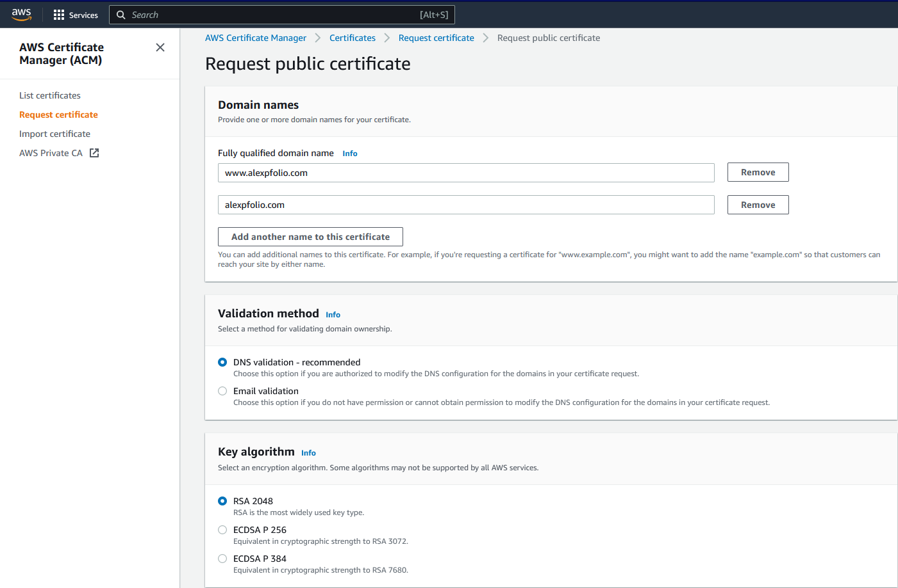

It will take some seconds until Amazon verifies the endpoints and that we are indeed the domain owner. In the meantime, we can continue by adding the certificate as records for both endpoints in Hosted Zones in Route 53 (Amazon provides some facilities for this process, which makes it very easy and user-friendly). In the end, in the configured records of Hosted Zones in Route 53, there should be two additional records of type CNAME.

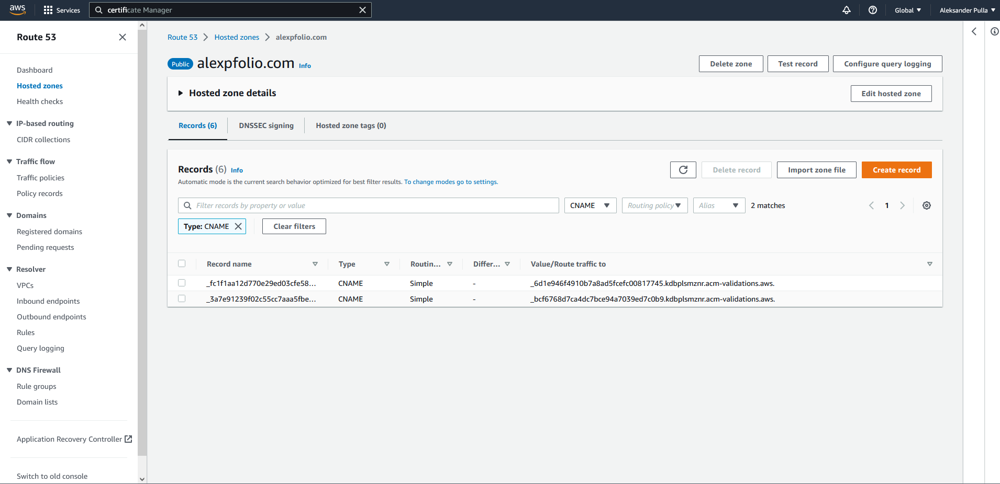

Now that we have a valid public certificate issued by Amazon and including its record in Route 53, let's open Amazon CloudFront and create two distributions for both S3 buckets.
For the primary bucket, we define the "Origin domain" with the value of this bucket's endpoint. The remaining options are kept the default ones.

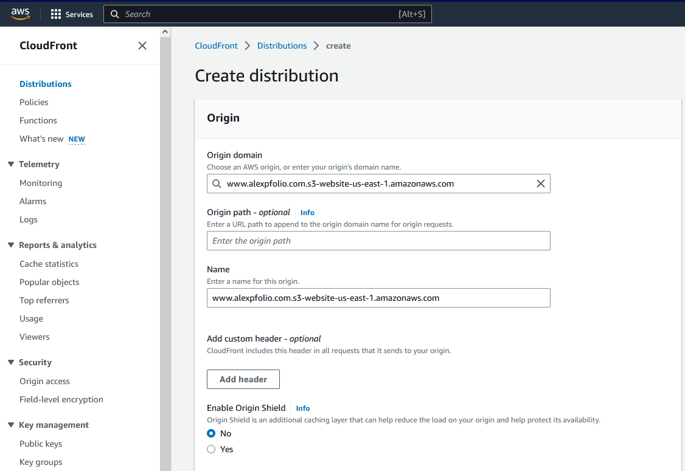

In the "Default cache behavior" section, we configure "Viewer protocol policy" feature to "Redirect HTTP to HTTPS" option. The remaining options are kept the default ones.

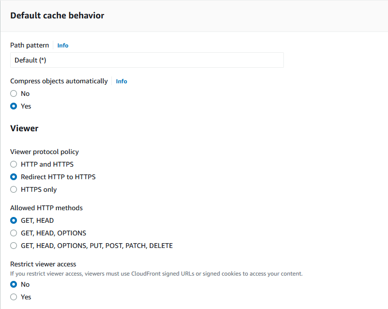

In the "Settings" section, we define the url of the primary endpoint in the "Alternate domain (CNAME)" feature.
Also, we select the public certificate that got issued to us in the "Custom SSL certificate" feature. 
The remaining options are kept the default ones.
In a similar manner, the same steps are followed for the secondary bucket.

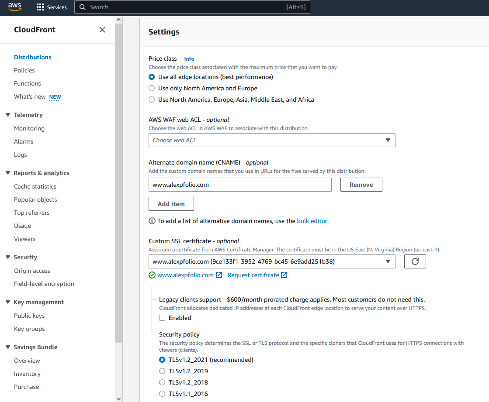

It will take some time until both distributions are deployed. When the operation finishes successfully, it should look as following.

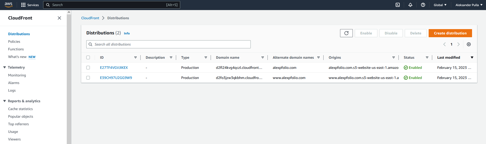

Now that the distributions got created, let's go back one more time in Amazon S3 and change the protocol of the secondary bucket from HTTP to HTTPS.

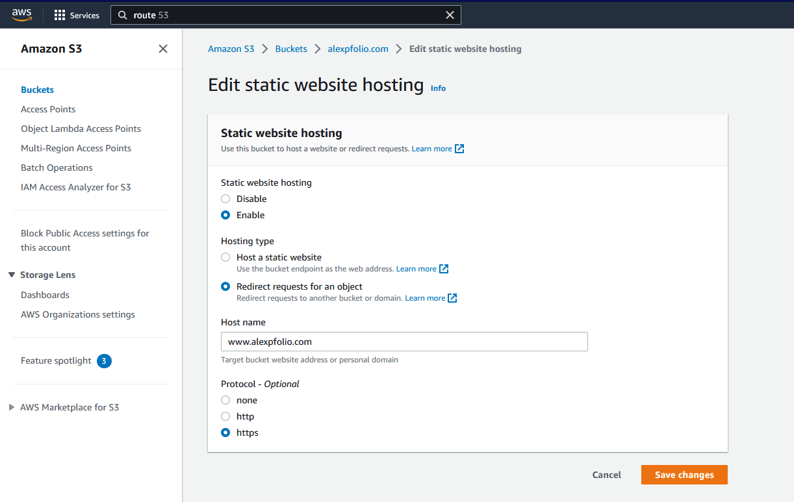

Since now we have the distributions that are using the S3 buckets endpoint, it's time to perform a re-routing of the records in Route 53. For the primary endpoint record, we change the "Route traffic to" option to "Alias to CloudFront distribution" and define the distribution endpoint as the value below.
The same step is performed for the remaining endpoint.

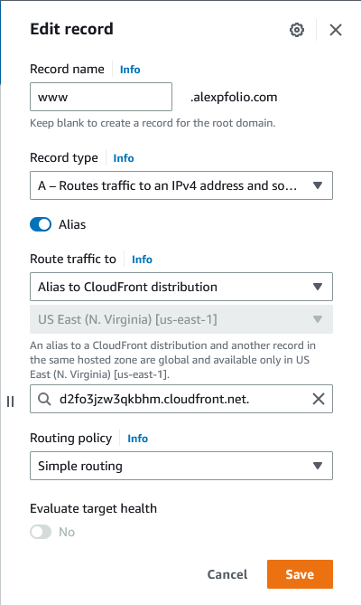

After saving the configurations and waiting some seconds until the caching process takes place let's open again the website.
This time we can notice that the connection got secured, as well as the protocol notation changed to HTTPS.

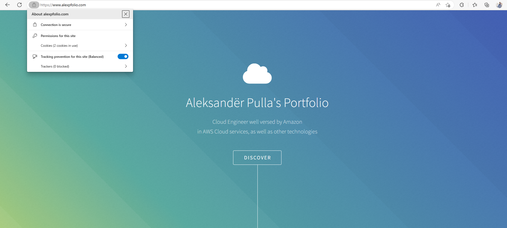

For validating purposes of performed steps, let's inspect the "Network" of the browser when we access the website. As you can see, "Server" corresponds to AmazonS3, which means that we have successfully hosted the web app in S3 bucket, but also that the traffic is routed at CloudFront, rather than S3 directly.

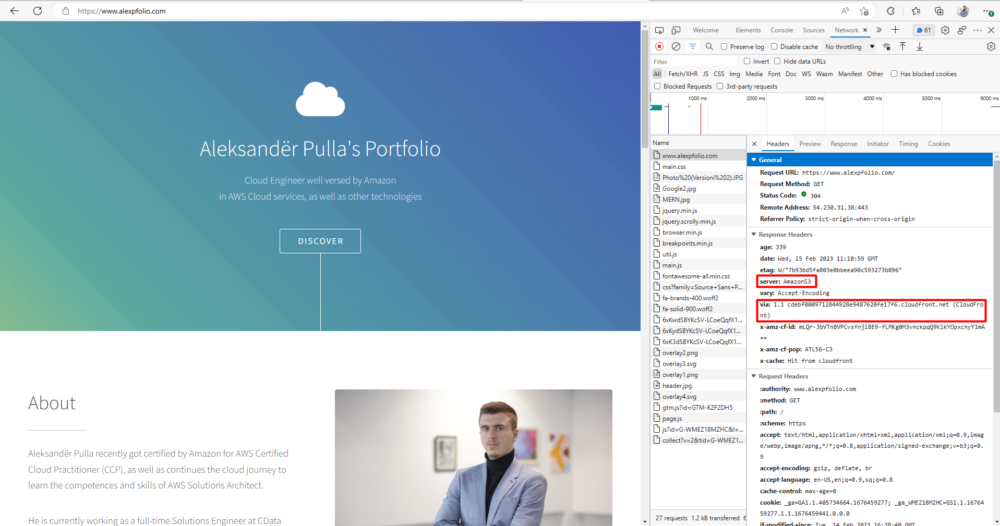

